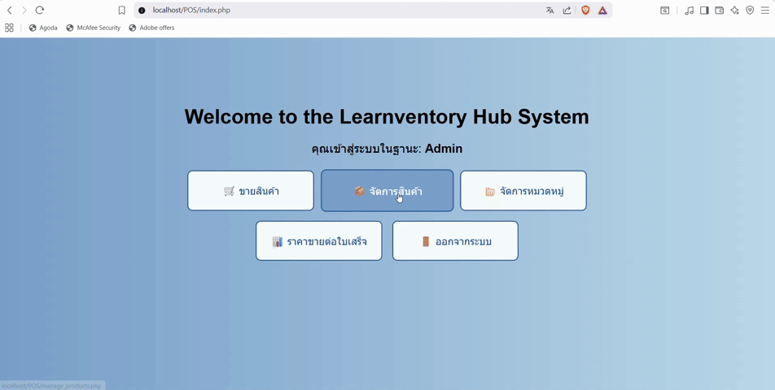

# 🛒 POS System (Learnventory Hub)

### A Point of Sale (POS) system for managing products, sales, and inventory. Built with PHP + MySQL, suitable for small to medium-sized businesses.


---

## 📌 Overview

This project is a POS system designed to:

- Manage products (CRUD operations)
- Manage product categories
- Record sales transactions
- Generate sales reports
- Support role-based access control (Admin / Staff)

---

## 🚀 Features

### 👤 Authentication & Authorization

- Login / Logout functionality  
- Session-based authentication  
- Role-based access control:
  - **Admin** → Manage products, categories, sales, and reports  
  - **Staff** → Process sales transactions only  

---

### 📦 Product Management (CRUD)

- Add new products  
- Edit existing products  
- Delete products  
- Assign products to categories  
- Display products in a table format  

---

### 📂 Category Management

- Create, update, and delete categories  
- Associate products with categories  

---

### 🛒 Sales System

- Select products for purchase  
- Automatic price calculation  
- Store sales transactions in the database  

---

### 📊 Sales Report

- Display sales summaries  
- View transaction details per receipt  

---

## 📸 Screenshots

### Registration


---

### Login


---

### Sell


---

### Manage Products


---

### Edit Products


---

### Manage Categories


---

### Sales Report


---

### Logout


---

## 🧑‍💻 Tech Stack

| Layer    | Technology       |
|----------|------------------|
| Frontend | HTML, CSS        |
| Backend  | PHP (Procedural) |
| Database | MySQL / MariaDB  |
| Server   | Apache (XAMPP)   |

---

## 📦 Project Structure

```bash
POS/
│
├── db.php                 # Database connection (MySQL)
├── index.php              # Dashboard (after login)
├── login.php              # Login page
├── logout.php             # Logout (destroy session)
│
├── manage_products.php    # Product management (list / add / delete)
├── edit_product.php       # Edit product details
│
├── manage_categories.php  # Category management
│
├── sell.php               # POS interface (sales page)
├── sales_report.php       # Sales reporting
│
├── css/
│   └── style.css
│
├── assets/                # Images, icons, static files
│
├── database/
│   └── pos_db.sql
│
└── README.md
```
---


## 🧠 Structure Explanation

- **db.php**  
  Handles database connection (separated for reusability)

- **Authentication (login/logout)**  
  Uses PHP sessions for user management

- **manage_products.php / edit_product.php**  
  Handles product CRUD operations

- **manage_categories.php**  
  Manages categories and their relationship with products

- **sell.php**  
  Core POS functionality for processing sales

- **sales_report.php**  
  Displays sales data in a report format

## Database Structure

### Main Tables:

- `Product` → Stores product data  
- `Categories` → Stores category data  
- `Users` → Stores user accounts  
- `Sales` → Stores sales transactions  

### Relationship:

- Product → Categories (Many-to-One)

---

## ⚙️ Installation

### 1. Clone the Project

```bash
git clone https://github.com/your-username/pos-system.git

---

### 2. Setup Database
- Open phpMyAdmin
- Create a new database (e.g., `pos_db`)
- Import the `.sql`
---

### 3. Config Database

Edit:

```php
db.php
```

```php
$conn = new mysqli("localhost", "root", "", "pos_db");
```

---

### 4. Run Project

- Start XAMPP (Apache + MySQL)
- Open in browser:

```
http://localhost/POS/
```

---

## 🔐 Default User (ตัวอย่าง)

| Role  | Username | Password |
| ----- | -------- | -------- |
| Admin | admin    | 1234     |
| Staff | staff    | 1234     |

---


## 📜 License

This project is created for **educational and portfolio purposes**.

---

## 👤 Author

* GitHub: https://github.com/May12365
---

---
